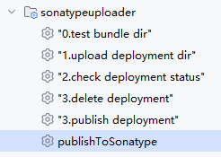
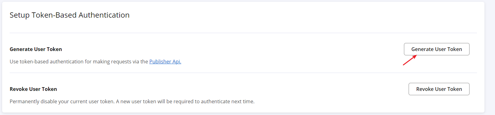

Sonatype Uploader
---
This is a gradle plugin to upload a artifact directory to maven central Repository.

# Simple to use  

The script is base on `build.gradle.kts`, you can reference the sample project if you want to use `build.gradle`.
1. if you had already configured `maven-publish` and `signing`, just use:  
```kotlin
plugins {
    id("io.github.jeadyx.sonatype-uploader") version "2.4"
}

sonatypeUploader {
    tokenName = "tokenUser"
    tokenPasswd = "tokenUserPasswd"
}
```

2. the common script:  
```kotlin
plugins {
   id("java-library")
   alias(libs.plugins.jetbrains.kotlin.jvm)
   id("org.jetbrains.dokka") version "1.9.20"
   id("io.github.jeadyx.sonatype-uploader") version "2.4"
}
group = "io.github.test"
version = "1.4"
sonatypeUploader {
   tokenName = "tokenUser"
   tokenPasswd = "tokenPassword"
   signing = Action<UploaderSigning> {
      keyId="9EAFF062"
      keyPasswd="123123"
      secretKeyPath="E:\\test_0x9EAFF062_SECRET.gpg"
   }
   pom = Action<MavenPom>{
      name = "My Library"
      description = "A concise description of my library greennbg"
      url = "http://www.example111.com/library"
      licenses {
         license {
            name = "The Apache License, Version 2.0"
            url = "http://www.apache.org/licenses/LICENSE-2.0.txt"
         }
      }
      developers {
         developer {
            id = "jeady"
            name = "jeady"
            email = "jeady@example.com"
         }
      }
      scm {
         connection = "scm:git:git://example.com/my-library.git"
         developerConnection = "scm:git:ssh://example.com/my-library.git"
         url = "http://example.com/my-library/"
      }
   }
}
```

3. the complete script:  
```kotlin
import io.github.jeadyx.UploaderSigning
plugins {
    id("org.jetbrains.dokka") version "1.9.20"
    id("io.github.jeadyx.sonatype-uploader") version "2.4"
}

group = "io.github.test"
version = "1.4"
val tokenUser: String by project
val tokenUserPasswd: String by project
sonatypeUploader {
    bundleName = "bundle_artifact_v1.0"
    artifactRoot = "E:\\repo\\io"
    tokenName = tokenUser
    tokenPasswd = tokenUserPasswd
    signing = Action<UploaderSigning> {
        keyId="9EAFF062"
        keyPasswd="123123"
        secretKeyPath="E:\\test_0x9EAFF062_SECRET.gpg"
    }
    pom = Action<MavenPom>{
        name = "My Library"
        description = "A concise description of my library greennbg"
        url = "http://www.example111.com/library"
        licenses {
            license {
                name = "The Apache License, Version 2.0"
                url = "http://www.apache.org/licenses/LICENSE-2.0.txt"
            }
        }
        developers {
            developer {
                id = "jeady"
                name = "jeady"
                email = "jeady@example.com"
            }
        }
        scm {
            connection = "scm:git:git://example.com/my-library.git"
            developerConnection = "scm:git:ssh://example.com/my-library.git"
            url = "http://example.com/my-library/"
        }
    }
}
```

After sync, you can find the gradle tasks:  
  

# Prepare  
## Sonatype Account [Maven Central Repository](https://central.sonatype.com/)  
1. Register a sonatype account.  
2. Create a NameSpace.  
3. Generate User Token.   
   

## maven-publish  
reference: [maven-publish](https://docs.gradle.org/current/userguide/publishing_maven.html)

## signing   
reference: [signing](https://docs.gradle.org/current/userguide/signing_plugin.html)  

# Sample  
[SonatypeUploaderSample Project](https://github.com/jeadyx/SonatypeUploaderSample)

# Reference  
This plugin is referenced from [Publishing By Using the Portal Publisher API](https://central.sonatype.org/publish/publish-portal-api/)

# Donate  

