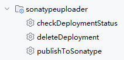
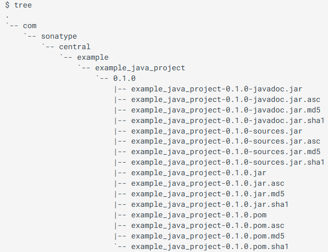

Sonatype Uploader
---
This is a gradle plugin that publish your maven artifact or upload a maven artifact directory to [maven central Repository](https://central.sonatype.com).

# Simple to use  

The script is base on `build.gradle.kts`, you can reference the sample project if you want to use `build.gradle`.
1. if you had already configured `maven-publish` publication and `signing` properties, just use:  
```kotlin
plugins {    
    `maven-publish`
    signing
    id("io.github.jeadyx.sonatype-uploader") version "2.7"
}

sonatypeUploader {
    repositoryPath = "your local maven repository" // The path configured at your publishing.repositories locally, ex: project.layout.buildDirectory.dir("repo").get().asFile.path
    tokenName = "tokenUser"
    tokenPasswd = "tokenUserPasswd"
}
```
*tip: you should have generated a [valid folder structure](#Valid tree structure) in your repository before you use this code snippet.*

2. the common script:  
```kotlin
plugins {
   id("org.jetbrains.dokka") version "1.9.20" // add this line when you using kotlin project else comment it
   id("io.github.jeadyx.sonatype-uploader") version "2.7"
}
group = "io.github.test"
version = "1.4"
sonatypeUploader {
   tokenName = "tokenUser"
   tokenPasswd = "tokenPassword"
   signing = Action<UploaderSigning> {
      keyId="9EAFF062"
      keyPasswd="123123"
      secretKeyPath="E:\\test_0x9EAFF062_SECRET.gpg"
   }
   pom = Action<MavenPom>{
      name = "My Library"
      description = "A concise description of my library greennbg"
      url = "http://www.example111.com/library"
      licenses {
         license {
            name = "The Apache License, Version 2.0"
            url = "http://www.apache.org/licenses/LICENSE-2.0.txt"
         }
      }
      developers {
         developer {
            id = "jeady"
            name = "jeady"
            email = "jeady@example.com"
         }
      }
      scm {
         connection = "scm:git:git://example.com/my-library.git"
         developerConnection = "scm:git:ssh://example.com/my-library.git"
         url = "http://example.com/my-library/"
      }
   }
}
```
*tip1: in this code snippet, you should replace the `signgin`, `tokenUser` and `tokenUserPasswd` with your own info.*  
*tip2: you can place secret info in `gradle.properties` file if you don't want to expose your secret info.*  

3. the complete script:  
```kotlin
import io.github.jeadyx.UploaderSigning
plugins {
    id("org.jetbrains.dokka") version "1.9.20"
    id("io.github.jeadyx.sonatype-uploader") version "2.7"
}

group = "io.github.test"
version = "1.4"
val tokenUser: String by project
val tokenUserPasswd: String by project
sonatypeUploader {
    bundleName = "bundle_artifact_v1.0" // this plugin will generate a bundle name for you automatically, but you can set it manually
    repositoryPath = "E:\\repo\\io" // only use this line when you configure `maven-publish` and `signing` plugin manually
    tokenName = tokenUser
    tokenPasswd = tokenUserPasswd
    signing = Action<UploaderSigning> {
        keyId="9EAFF062"
        keyPasswd="123123"
        secretKeyPath="E:\\test_0x9EAFF062_SECRET.gpg"
    }
    pom = Action<MavenPom>{
        name = "My Library"
        description = "A concise description of my library greennbg"
        url = "http://www.example111.com/library"
        licenses {
            license {
                name = "The Apache License, Version 2.0"
                url = "http://www.apache.org/licenses/LICENSE-2.0.txt"
            }
        }
        developers {
            developer {
                id = "jeady"
                name = "jeady"
                email = "jeady@example.com"
            }
        }
        scm {
            connection = "scm:git:git://example.com/my-library.git"
            developerConnection = "scm:git:ssh://example.com/my-library.git"
            url = "http://example.com/my-library/"
        }
    }
}
```

# Prepare  
## Sonatype Account [Maven Central Repository](https://central.sonatype.com/)  
1. Register a sonatype account.  
2. Create a NameSpace.  
3. Generate User Token.   
   

## maven-publish  
reference: [maven-publish](https://docs.gradle.org/current/userguide/publishing_maven.html)  

## signing     
reference: [signing](https://docs.gradle.org/current/userguide/signing_plugin.html)  

# Tasks  
After sync:  
* if `maven-publish` and `signing` plugin has been configured, you can find the tasks:  
  
* else  
    

# Sample  
[SonatypeUploaderSample Project](https://github.com/jeadyx/SonatypeUploaderSample)  

# Reference  
This plugin is referenced from [Publishing By Using the Portal Publisher API](https://central.sonatype.org/publish/publish-portal-api/)  

# Valid tree structure  
  

# Donate   
  
